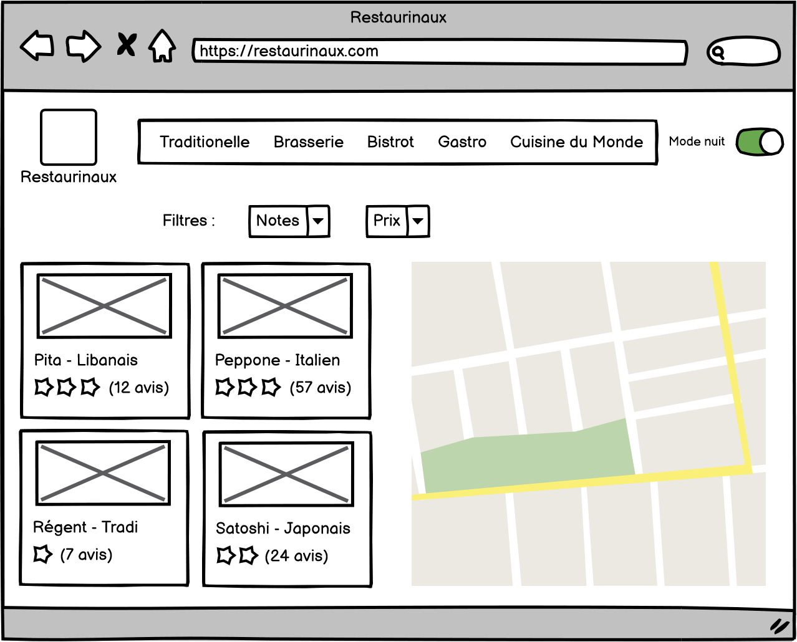

# Restaurinaux

Restaurinaux est un comparateur de restaurants sur Bordeaux

Lien vers le site : https://titouan-monier.github.io/Restaurinaux/

Maquette du site:

14/02/2022 : Le Projet Restaurinaux est relancé en projet professionnel avec le CESI.
Il va devoir respecter un cahier des charges bien précis.
Les Objectifs vont être :
  I- Analayse Fonctionnelle et modélisation de la base de donnée
  II-Refonte Graphique en html/css et Bootstrap
  III-Création de la base de donnée avec Phpmyadmin
  IV-Création du back en Php
